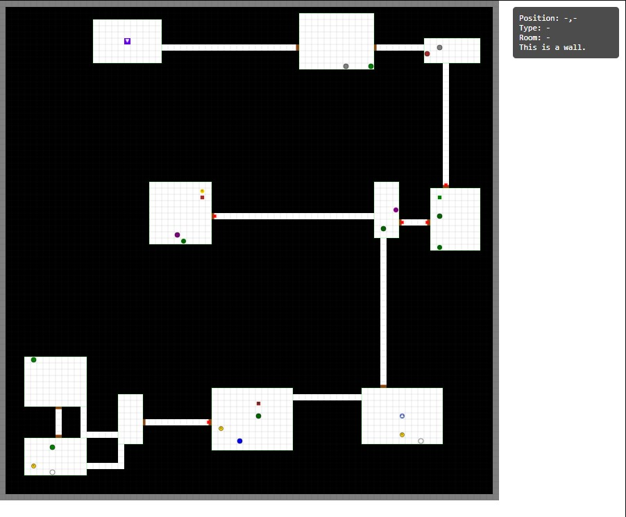

[](https://github.com/armysarge/DungeonGeneratorJS)

[](https://www.buymeacoffee.com/armysarge)

[](https://opensource.org/licenses/MIT)

[](https://www.javascript.com/)
[](https://www.w3schools.com/html/)
[](https://www.w3schools.com/css/)
[](https://threejs.org/)

[](https://github.com/armysarge/DungeonGeneratorJS/issues)

# DungeonGenJS

An object-oriented JavaScript library for procedurally generating rich, customizable dungeons with gameplay elements.

--STILL WORK IN PROGRESS--

## Features

- **Procedural Generation**: Create unique dungeon layouts using Binary Space Partitioning (BSP)
- **Complete Dungeon Ecosystem**:
  - Interconnected rooms with natural corridors
  - Locked/trapped doors with keys hidden throughout
  - Treasure chests with quality tiers (common to legendary)
  - Strategically placed creatures with varied difficulty levels
- **Smart Gameplay Design**:
  - Logical room placement and connectivity
  - Progressive difficulty with stronger monsters in locked rooms
  - Better loot in harder-to-reach areas
  - Coherent adventure flow from player start to exit stairs
- **Highly Customizable**:
  - Seed-based generation for reproducible dungeons
  - Adjustable parameters (room size, creature density, etc.)
  - Configurable loot tables and creature types
- **Visual Debug Mode**: See room connections, entity placement, and more

## Coming Soon

- **3D Visualization**: Full Three.js integration for 3D dungeon rendering with:
  - Texture-mapped walls, floors, and ceilings
  - Dynamic lighting effects and shadows
  - First-person and top-down viewing modes

- **Gameplay Mechanics**:
  - Turn-based or real-time combat system
  - Character stats and progression
  - Inventory management
  - Interactive objects (levers, pressure plates, etc.)
  - Quest system integration capabilities

- **Expanded Customization**:
  - Dungeon themes (cave, castle, crypt, etc.)
  - Additional room types (libraries, shrines, armories)
  - Environmental hazards and traps

## Demo

[Live Demo](https://armysarge.co.za/DungeonGenJS/index.html) - Try the generator in your browser!


*Example of a generated dungeon with rooms, corridors, and entities*

## Setup Instructions
1. Clone the repository or download the project files.
2. Open `index.html` in a web browser to run the application.
3. Ensure that you have an internet connection to load Three.js from the CDN.

## Usage Example

```javascript
// Create a dungeon with specified dimensions and optional seed
const dungeon = new Dungeon(80, 80, 123456);

// Generate the full dungeon with all elements
dungeon.generateDungeon();

// Render the dungeon with included renderer
const dungeonRenderer = new DungeonRenderer(sceneManager, dungeon);
dungeonRenderer.render('2D');

// Access dungeon elements
console.log(`Generated ${dungeon.rooms.length} rooms`);
console.log(`Placed ${dungeon.creatures.length} creatures`);
console.log(`Created ${dungeon.chests.length} treasure chests`);
```

## Core Classes

| Class | Description |
|-------|-------------|
| **Dungeon** | Central manager class handling generation and storing all dungeon components. |
| **Room** | Represents individual rooms with properties like size and connectivity. |
| **Corridor** | Manages pathways between rooms, ensuring they follow natural layouts. |
| **Creature** | Monsters with different types, health levels, and loot. |
| **Chest** | Containers with quality tiers (common to legendary) and appropriate treasures. |
| **Item** | Represents keys, gold, and other items that can be found in the dungeon. |
| **DungeonRenderer** | Visualizes the dungeon on HTML canvas with hover tooltips. |

## Generation Pipeline

1. **Room Placement**: Recursive partitioning to create rooms of varied sizes
2. **Corridor Generation**: Minimum spanning tree algorithm ensures all rooms are connected with additional loops for exploration
3. **Door Placement**: Smart door placement with locked/trapped variations
4. **Chest Placement**: Strategic chest distribution with better items in harder-to-reach areas
5. **Creature Placement**: Enemy distribution based on room type and location
6. **Key Placement**: Accessibility checks ensure keys are logically placed
7. **Player and Stairs Placement**: Defines start and end points of the dungeon

## License

MIT

## Contributing

Contributions welcome! Feel free to submit pull requests or open issues with suggestions and bug reports.